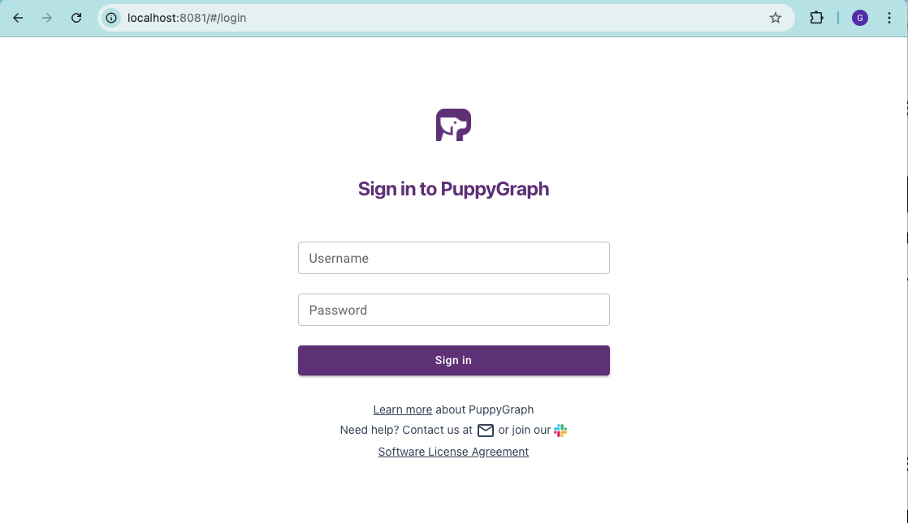
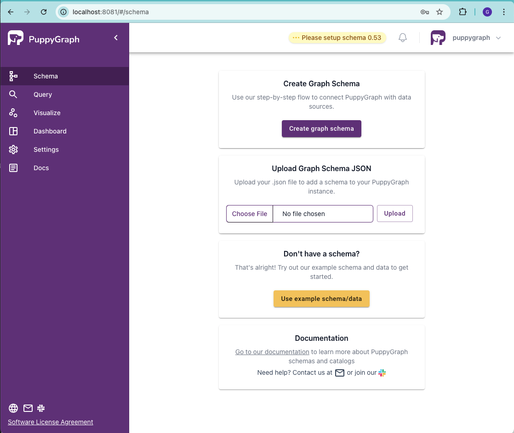
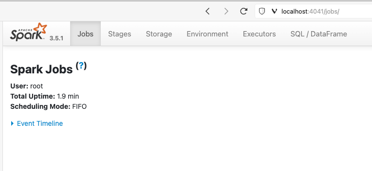
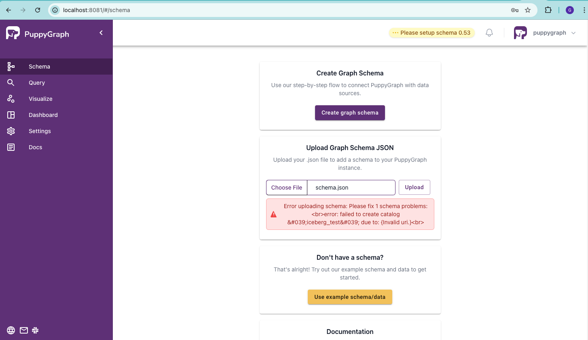
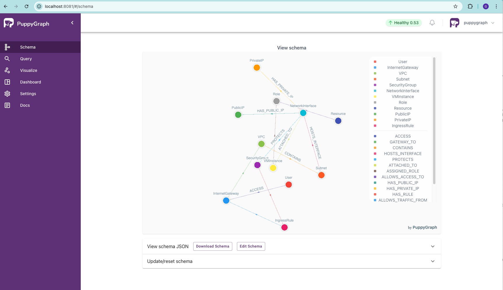
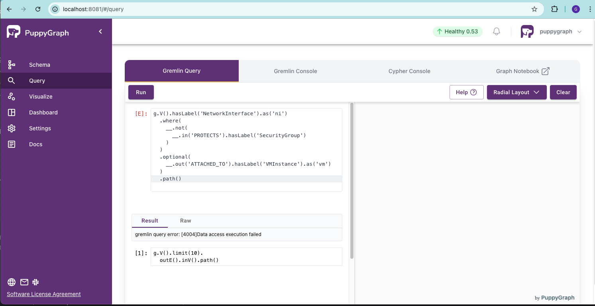

# puppygraph-on-k8s

Deploy PuppyGraph and iceberg on Kubernetes and simulate the Wiz security graph.

This is heavily based on
PuppyGraph's [cloud-security-graph-demo](https://github.com/puppygraph/puppygraph-getting-started/tree/main/use-case-demos/cloud-security-graph-demo)

## Prepare data ✅

We need to convert the data to parquet format. We will use Python + pandas library to read the CSV
file and write it to parquet format. Let's create a Python virtual environment and install the
required libraries.

```bash
python -m venv venv
source venv/bin/activate

pip install pandas pyarrow
```

Run the conversion script

```
python CsvToParquet.py ./csv_data ./parquet_data
CSV file ./csv_data/VPCs.csv has been successfully converted to Parquet. Output file: ./parquet_data/VPCs.parquet
CSV file ./csv_data/SecurityGroups.csv has been successfully converted to Parquet. Output file: ./parquet_data/SecurityGroups.parquet
CSV file ./csv_data/InternetGatewayVPC.csv has been successfully converted to Parquet. Output file: ./parquet_data/InternetGatewayVPC.parquet
CSV file ./csv_data/InternetGateways.csv has been successfully converted to Parquet. Output file: ./parquet_data/InternetGateways.parquet
CSV file ./csv_data/IngressRuleInternetGateway.csv has been successfully converted to Parquet. Output file: ./parquet_data/IngressRuleInternetGateway.parquet
CSV file ./csv_data/IngressRules.csv has been successfully converted to Parquet. Output file: ./parquet_data/IngressRules.parquet
CSV file ./csv_data/Users.csv has been successfully converted to Parquet. Output file: ./parquet_data/Users.parquet
CSV file ./csv_data/Resources.csv has been successfully converted to Parquet. Output file: ./parquet_data/Resources.parquet
CSV file ./csv_data/PublicIPs.csv has been successfully converted to Parquet. Output file: ./parquet_data/PublicIPs.parquet
CSV file ./csv_data/VMInstances.csv has been successfully converted to Parquet. Output file: ./parquet_data/VMInstances.parquet
CSV file ./csv_data/RoleResourceAccess.csv has been successfully converted to Parquet. Output file: ./parquet_data/RoleResourceAccess.parquet
CSV file ./csv_data/Subnets.csv has been successfully converted to Parquet. Output file: ./parquet_data/Subnets.parquet
CSV file ./csv_data/UserInternetGatewayAccess.csv has been successfully converted to Parquet. Output file: ./parquet_data/UserInternetGatewayAccess.parquet
CSV file ./csv_data/NetworkInterfaces.csv has been successfully converted to Parquet. Output file: ./parquet_data/NetworkInterfaces.parquet
CSV file ./csv_data/PrivateIPs.csv has been successfully converted to Parquet. Output file: ./parquet_data/PrivateIPs.parquet
CSV file ./csv_data/SubnetSecurityGroup.csv has been successfully converted to Parquet. Output file: ./parquet_data/SubnetSecurityGroup.parquet
CSV file ./csv_data/Roles.csv has been successfully converted to Parquet. Output file: ./parquet_data/Roles.parquet
```

## Create kind cluster ✅

```bash
❯ kind create cluster --name puppygraph --config manifests/kind-config.yaml
Creating cluster "puppygraph" ...
 ✓ Ensuring node image (kindest/node:v1.32.0) 🖼
 ✓ Preparing nodes 📦 📦  
 ✓ Writing configuration 📜 
 ✓ Starting control-plane 🕹️ 
 ✓ Installing CNI 🔌 
 ✓ Installing StorageClass 💾 
 ✓ Joining worker nodes 🚜 
Set kubectl context to "kind-puppygraph"
You can now use your cluster with:

kubectl cluster-info --context kind-puppygraph

Thanks for using kind! 😊
```

## Deploy PuppyGraph + Iceberg + Minio ✅

```bash
❯ kubectl apply -f manifests/k8s.yaml
namespace/puppy-iceberg created
service/spark-iceberg created
deployment.apps/spark-iceberg created
service/rest created
deployment.apps/iceberg-rest created
service/minio created
deployment.apps/minio created
deployment.apps/mc created
service/puppygraph created
deployment.apps/puppygraph created
persistentvolume/warehouse-volume created
persistentvolume/notebooks-volume created
persistentvolume/parquet-volume created
```

## Verify deployments ✅

```bash
❯ kubectl get deployment -n puppy-iceberg
NAME            READY   UP-TO-DATE   AVAILABLE   AGE
iceberg-rest    1/1     1            1           22m
mc              1/1     1            1           22m
minio           1/1     1            1           22m
puppygraph      1/1     1            1           22m
spark-iceberg   1/1     1            1           22m
```

## Verify services ✅

```bash
❯ kubectl get svc -n puppy-iceberg 
NAME            TYPE        CLUSTER-IP      EXTERNAL-IP   PORT(S)                                                         AGE
minio           ClusterIP   10.96.105.186   <none>        9000/TCP,9001/TCP                                               2m23s
puppygraph      ClusterIP   10.96.39.141    <none>        8081/TCP,8182/TCP,7687/TCP                                      2m23s
rest            ClusterIP   10.96.89.116    <none>        8181/TCP                                                        2m23s
spark-iceberg   NodePort    10.96.201.87    <none>        8888:30088/TCP,8080:30080/TCP,10000:30000/TCP,10001:30001/TCP   2m23s
````

## Connect to Puupygraph and Spark Iceberg ✅

Let's connect to the PuppyGraph Web UI. We need to port-forward the service to our local machine.

```bash
kubectl port-forward deploy/puppy 8081:8081 -n puppy-iceberg
```

This will bring up the login page.



Use the default credentials - username: puppygraph, password: puppygraph123.

This will bring up the schema page.



The next step is to connect to Spark Iceberg.

```bash
❯ kubectl exec -it deploy/spark-iceberg -- spark-sql
Setting default log level to "WARN".
To adjust logging level use sc.setLogLevel(newLevel). For SparkR, use setLogLevel(newLevel).
25/02/02 00:32:37 WARN NativeCodeLoader: Unable to load native-hadoop library for your platform... using builtin-java classes where applicable
25/02/02 00:32:38 WARN Utils: Service 'SparkUI' could not bind on port 4040. Attempting port 4041.
Spark Web UI available at http://spark-iceberg-5597fcb949-8xkm8:4041
Spark master: local[*], Application Id: local-1738456358826
spark-sql ()> 
```

To access the web UI we need to pord forward the pod.

```
❯ kubectl port-forward deploy/spark-iceberg 4041:4041
Forwarding from 127.0.0.1:4041 -> 4041
Forwarding from [::1]:4041 -> 4041
```



## Preparing the DB ❌

We need to create the tables in the Iceberg format. We will use the Spark Iceberg pod to do this.

Here is what it looks like in the original docker-compose setup from
PuppyGraph's [cloud scuirty graph demo](https://github.com/puppygraph/puppygraph-getting-started/blob/main/use-case-demos/cloud-security-graph-demo/README.md#data-import):

```bash
❯ sudo docker exec -it spark-iceberg spark-sql
Password:
Setting default log level to "WARN".
To adjust logging level use sc.setLogLevel(newLevel). For SparkR, use setLogLevel(newLevel).
25/02/02 02:01:09 WARN NativeCodeLoader: Unable to load native-hadoop library for your platform... using builtin-java classes where applicable
25/02/02 02:01:10 WARN Utils: Service 'SparkUI' could not bind on port 4040. Attempting port 4041.
Spark Web UI available at http://bb5e53e5ed90:4041
Spark master: local[*], Application Id: local-1738461671048
spark-sql ()> CREATE DATABASE security_graph;
Time taken: 1.326 seconds

spark-sql ()> CREATE EXTERNAL TABLE security_graph.Users (
            >   user_id BIGINT,
            >   username STRING
            > ) USING iceberg;
Time taken: 0.949 seconds
spark-sql ()>
```

When we try this in the Kubernetes setup, we can create the `security_graph` database successfully,
but creating a table fails:

```bash
❯ kubectl exec -it deploy/spark-iceberg -- spark-sql
Setting default log level to "WARN".
To adjust logging level use sc.setLogLevel(newLevel). For SparkR, use setLogLevel(newLevel).
25/02/02 02:17:53 WARN NativeCodeLoader: Unable to load native-hadoop library for your platform... using builtin-java classes where applicable
25/02/02 02:17:54 WARN Utils: Service 'SparkUI' could not bind on port 4040. Attempting port 4041.
Spark Web UI available at http://spark-iceberg-5597fcb949-gfb6t:4041
Spark master: local[*], Application Id: local-1738462674045
spark-sql ()> CREATE DATABASE security_graph;
Time taken: 1.027 seconds

spark-sql ()> CREATE EXTERNAL TABLE security_graph.Users (
            >   user_id BIGINT,
            >   username STRING
            > ) USING iceberg;
25/02/02 02:18:26 ERROR SparkSQLDriver: Failed in [CREATE EXTERNAL TABLE security_graph.Users (
  user_id BIGINT,
  username STRING
) USING iceberg]
org.apache.iceberg.exceptions.ServiceFailureException: Server error: SdkClientException: Received an UnknownHostException when attempting to interact with a service. See cause for the exact endpoint that is failing to resolve. If this is happening on an endpoint that previously worked, there may be a network connectivity issue or your DNS cache could be storing endpoints for too long.
        at org.apache.iceberg.rest.ErrorHandlers$DefaultErrorHandler.accept(ErrorHandlers.java:217)
        at org.apache.iceberg.rest.ErrorHandlers$TableErrorHandler.accept(ErrorHandlers.java:118)
        at org.apache.iceberg.rest.ErrorHandlers$TableErrorHandler.accept(ErrorHandlers.java:102)
        ...
spark-sql ()> 
```

The code for the REST catalog server is here:
https://github.com/databricks/iceberg-rest-image/blob/master/src/main/java/org/apache/iceberg/rest/RESTCatalogServer.java

In the logs of iceberg-rest we see the following error:

```
❯ k logs deploy/iceberg-rest | rg minio
2025-02-02T07:37:17.281 INFO  [org.apache.iceberg.rest.RESTCatalogServer] - Creating catalog with properties: {jdbc.password=password, s3.endpoint=http://minio.puppy-iceberg.svc.cluster.local:9000, jdbc.user=user, io-impl=org.apache.iceberg.aws.s3.S3FileIO, catalog-impl=org.apache.iceberg.jdbc.JdbcCatalog, jdbc.schema-version=V1, warehouse=s3://warehouse/, uri=jdbc:sqlite:file:/tmp/iceberg_rest_mode=memory, s3.path.style.access=true}
Caused by: software.amazon.awssdk.core.exception.SdkClientException: Unable to execute HTTP request: warehouse.minio.puppy-iceberg.svc.cluster.local
	Suppressed: software.amazon.awssdk.core.exception.SdkClientException: Request attempt 1 failure: Unable to execute HTTP request: warehouse.minio.puppy-iceberg.svc.cluster.local: Name or service not known
	Suppressed: software.amazon.awssdk.core.exception.SdkClientException: Request attempt 2 failure: Unable to execute HTTP request: warehouse.minio.puppy-iceberg.svc.cluster.local
	Suppressed: software.amazon.awssdk.core.exception.SdkClientException: Request attempt 3 failure: Unable to execute HTTP request: warehouse.minio.puppy-iceberg.svc.cluster.local
Caused by: java.net.UnknownHostException: warehouse.minio.puppy-iceberg.svc.cluster.local```
```

The issue is that the REST catalog server is trying to connect to the Minio service using the wrong
URL:
warehouse.minio.puppy-iceberg.svc.cluster.local

It should be just `minio.puppy-iceberg.svc.cluster.local`

This is a virtual domain access style. We need the path access style.

All the attmpts to force path access style failed 😢.

## Hacking Core DNS ❌

First get the IP address of minio service

```bash
❯ kubectl get svc minio -o yaml | yq .spec.clusterIP
10.96.50.71
```

Let's add this to the CoreDNS configmap:

```yaml
        template IN A *.minio {
        match ^(.+)\.minio\.$
        answer "{{ .Name }} 60 IN A 10.96.50.71"
        }
```        

Then, restarting the core DNS service

```
❯ kubectl rollout restart deploy/coredns -n kube-system
deployment.apps/coredns restarted
```

hmmmm.... that didn't work either ¯\_(ツ)_/¯

# Switch backend to Hadoop File System ✅

This is much simpler. We get rid of minio + mc and use the local file system on the rest catlog
server.

```
❯ kubectl get deployment -n puppy-iceberg
NAME            READY   UP-TO-DATE   AVAILABLE   AGE
iceberg-rest    1/1     1            1           15h
puppygraph      1/1     1            1           15h
spark-iceberg   1/1     1            1           15h

❯ kubectl get svc -n puppy-iceberg
NAME            TYPE        CLUSTER-IP      EXTERNAL-IP   PORT(S)                                                         AGE
puppygraph      ClusterIP   10.96.191.124   <none>        8081/TCP,8182/TCP,7687/TCP                                      15h
rest            ClusterIP   10.96.125.70    <none>        8181/TCP                                                        15h
spark-iceberg   NodePort    10.96.62.23     <none>        8888:30088/TCP,8080:30080/TCP,10000:30000/TCP,10001:30001/TCP   15h
```

## Create the database ❌

Now, creating the database fails:

```
spark-sql ()> CREATE DATABASE security_graph;
25/02/02 08:39:10 ERROR SparkSQLDriver: Failed in [CREATE DATABASE security_graph]
org.apache.iceberg.exceptions.RESTException: Unable to process: Cannot create namespace security_graph: metadata is not supported
```

## Create the tables ✅

That's OK. The catalog server treats the DB as a namespace we can just skip this step and create the
tables directly.

For example:

```
CREATE EXTERNAL  TABLE IF NOT EXISTS security_graph.Users (
  user_id BIGINT,
  username STRING
) USING iceberg;
```

To create all the tables run the script:

```bash
./prepare-db.sh
```

## Insert the data ❌

All the tables are created successfully, but inserting the data fails. It looks like something is
hard-coded to use s3 storage, so it fails for the Hadoop file system backend.

```
spark-sql ()> INSERT INTO security_graph.Users
            > SELECT * FROM parquet.`/parquet_data/Users.parquet`;
25/02/02 21:13:18 ERROR Executor: Exception in task 0.0 in stage 1.0 (TID 1)
org.apache.iceberg.exceptions.ValidationException: Invalid S3 URI, cannot determine scheme: file:/data/warehouse/security_graph/Users/data/00000-1-d7858365-5038-44c2-823d-024e1eb22be1-0-00001.parquet
	at org.apache.iceberg.exceptions.ValidationException.check(ValidationException.java:49)
	at org.apache.iceberg.aws.s3.S3URI.<init>(S3URI.java:72)
	at org.apache.iceberg.aws.s3.S3OutputFile.fromLocation(S3OutputFile.java:42)
	at org.apache.iceberg.aws.s3.S3FileIO.newOutputFile(S3FileIO.java:135)
	at org.apache.iceberg.io.OutputFileFactory.newOutputFile(OutputFileFactory.java:105)
```

## Debugging the issue 🪲

Looks like S3 is a default

```
❯ kubectl exec -it deploy/spark-iceberg -- cat /opt/spark/conf/spark-defaults.conf | grep -i iceberg
spark.sql.extensions                   org.apache.iceberg.spark.extensions.IcebergSparkSessionExtensions
spark.sql.catalog.demo                 org.apache.iceberg.spark.SparkCatalog
spark.sql.catalog.demo.io-impl         org.apache.iceberg.aws.s3.S3FileIO
spark.eventLog.dir                     /home/iceberg/spark-events
spark.history.fs.logDirectory          /home/iceberg/spark-events
```

This is coming from here:

https://github.com/databricks/docker-spark-iceberg/blob/main/spark/spark-defaults.conf#L26

```
spark.sql.extensions                   org.apache.iceberg.spark.extensions.IcebergSparkSessionExtensions
spark.sql.catalog.demo                 org.apache.iceberg.spark.SparkCatalog
spark.sql.catalog.demo.type            rest
spark.sql.catalog.demo.uri             http://rest:8181
spark.sql.catalog.demo.io-impl         org.apache.iceberg.aws.s3.S3FileIO
spark.sql.catalog.demo.warehouse       s3://warehouse/wh/
spark.sql.catalog.demo.s3.endpoint     http://minio:9000
spark.sql.defaultCatalog               demo
spark.eventLog.enabled                 true
spark.eventLog.dir                     /home/iceberg/spark-events
spark.history.fs.logDirectory          /home/iceberg/spark-events
spark.sql.catalogImplementation        in-memory
```

Fix the Spark Icebergg default ✅

```bash
❯ kubectl exec -it deploy/spark-iceberg -- \
  sed -i -e 's|spark.sql.catalog.demo.warehouse\s\+s3://warehouse/wh/|spark.sql.catalog.demo.warehouse file:/data/warehouse|' \
         -e 's|spark.sql.catalog.demo.io-impl\s\+org.apache.iceberg.aws.s3.S3FileIO|spark.sql.catalog.demo.io-impl org.apache.iceberg.hadoop.HadoopFileIO|' \
  /opt/spark/conf/spark-defaults.conf
```

We can also remove the S3 endpoint, which is not needed anymore:

```
❯ kubectl exec -it deploy/spark-iceberg -- \
  sed -i '/spark.sql.catalog.demo.s3.endpoint/d' /opt/spark/conf/spark-defaults.conf
```

Verify it was updated correctly:

```
❯ kubectl exec -it deploy/spark-iceberg -- cat /opt/spark/conf/spark-defaults.conf | rg spark
# Default system properties included when running spark-submit.
spark.sql.extensions                   org.apache.iceberg.spark.extensions.IcebergSparkSessionExtensions
spark.sql.catalog.demo                 org.apache.iceberg.spark.SparkCatalog
spark.sql.catalog.demo.type            rest
spark.sql.catalog.demo.uri             http://rest:8181
spark.sql.catalog.demo.io-impl org.apache.iceberg.hadoop.HadoopFileIO
spark.sql.catalog.demo.warehouse file:/data/warehouse
spark.sql.defaultCatalog               demo
spark.eventLog.enabled                 true
spark.eventLog.dir                     /home/iceberg/spark-events
spark.history.fs.logDirectory          /home/iceberg/spark-events
spark.sql.catalogImplementation        in-memory
```

## Insert the data ✅

Now we can try to insert the data again:

```
❯ ./prepare_db.sh
Finding pod for deployment spark-iceberg...
Pod found: spark-iceberg-5597fcb949-5l78c
Copying security_graph.sql to pod spark-iceberg-5597fcb949-5l78c at /tmp/security_graph.sql...
File copied successfully.
Copying parquet_data to pod spark-iceberg-5597fcb949-5l78c at /...
Directory copied successfully.
Executing security_graph.sql on pod spark-iceberg-5597fcb949-5l78c using spark-sql...
Setting default log level to "WARN".
To adjust logging level use sc.setLogLevel(newLevel). For SparkR, use setLogLevel(newLevel).
25/02/02 22:33:42 WARN NativeCodeLoader: Unable to load native-hadoop library for your platform... using builtin-java classes where applicable
25/02/02 22:33:43 WARN Utils: Service 'SparkUI' could not bind on port 4040. Attempting port 4041.
Spark Web UI available at http://spark-iceberg-5597fcb949-5l78c:4041
Spark master: local[*], Application Id: local-1738535623310
Time taken: 1.219 seconds
Time taken: 0.029 seconds
.
.
.
SQL script executed successfully!
```

## Uploading the schema to PuppyGraph fails ❌

The next step is to upload a schema to PuppyGraph. First, let's port-forward the service, so we can
access it locally:

```bash
kubectl port-forward deploy/puppygraph 8081:8081 -n puppy-iceberg
```

Now, we can try upload the schema, which fails with invalid uri error:

```
❯ curl -XPOST -H "content-type: application/json" --data-binary @./schema.json --user "puppygraph:puppygraph123" localhost:8081/schema
Handling connection for 8081
{"Status":"Error","Message":"Please fix 1 schema problems:\nerror: failed to create catalog 'iceberg_test' due to: {Invalid uri.}\n"}
```

We get the exact same error if trying to upload through the web UI.



## Review the schema file and fix the URI ✅

The schema had the wrong URI. We need to change from:

```
"uri": "http://iceberg-rest:8181"
```

to:

```
"uri": "http://rest:8181"
```

## Uploading the schema to PuppyGraph ✅

Now uploading the schema works:

```
❯ curl -XPOST -H "content-type: application/json" --data-binary @./schema.json --user "puppygraph:puppygraph123" localhost:8081/schema
Handling connection for 8081
{"Status":"OK","Message":"Schema uploaded and gremlin server restarted"}
```



## Querying the graph fails ❌

Using a sample query fails with "[4004]Data access execution failed":

```
g.V().hasLabel('NetworkInterface').as('ni')
  .where(
    __.not(
      __.in('PROTECTS').hasLabel('SecurityGroup')
    )
  )
  .optional(
    __.out('ATTACHED_TO').hasLabel('VMInstance').as('vm')
  )
  .path()
```



The logs are not very helpful. They just say the /submit request failed with 400:

```
❯ kubectl logs deploy/puppygraph
[Frontend] [2025-02-03 00:21:58] INFO
PuppyGraph (puppygraph.com) version: 0.53 - A graph analytics engine for all your data.
[Frontend] [2025-02-03 00:21:58] INFO  Build timestamp: 2025-01-17_00:21:26
[Frontend] [2025-02-03 00:21:58] INFO  Getting memory limit in kubernetes
[Frontend] [2025-02-03 00:21:58] WARNING Unable to get total memory, skip memory limit inference: failed to get container memory limit in kubernetes: could not find cgroup memory limit: cgroup file not found: stat /sys/fs/cgroup/memory/docker/memory.limit_in_bytes: no such file or directory
[Frontend] [2025-02-03 00:21:58] INFO  Using default config
[Frontend] [2025-02-03 00:21:58] INFO  Start as single all-in-one node
[Frontend] [2025-02-03 00:21:58] INFO  Starting data access FE.
[Frontend] [2025-02-03 00:21:58] INFO  [fe] Process ready to start
[Frontend] [2025-02-03 00:21:58] INFO  Waiting for data access FE to start.
[Frontend] [2025-02-03 00:21:58] INFO  Poll[op=GetConnection] start interval=1s, reportInterval=30s, timeout=5m0s
[Frontend] [2025-02-03 00:21:58] INFO  [fe][0x40001fe980] Monitor begin: pid[139]
[Frontend] [2025-02-03 00:21:59] INFO  Poll[op=GetConnection] success, elapsed=1.002438875s
[Frontend] [2025-02-03 00:21:59] INFO  Waiting for data access FE to be ready.
[Frontend] [2025-02-03 00:21:59] INFO  Poll[op=WaitForAlive] start interval=1s, reportInterval=30s, timeout=24h0m0s
[Frontend] [2025-02-03 00:22:11] INFO  Poll[op=WaitForAlive] success, elapsed=12.21189063s
[Frontend] [2025-02-03 00:22:11] INFO  Data access FE is ready.
[Frontend] [2025-02-03 00:22:11] INFO  Waiting for data access FE to start.
[Frontend] [2025-02-03 00:22:11] INFO  Poll[op=GetConnection] start interval=1s, reportInterval=30s, timeout=5m0s
[Frontend] [2025-02-03 00:22:12] INFO  Poll[op=GetConnection] success, elapsed=1.005978334s
[Frontend] [2025-02-03 00:22:12] INFO  Waiting for data access FE to be ready.
[Frontend] [2025-02-03 00:22:12] INFO  Poll[op=WaitForAlive] start interval=1s, reportInterval=30s, timeout=24h0m0s
[Frontend] [2025-02-03 00:22:13] INFO  Poll[op=WaitForAlive] success, elapsed=1.082096209s
[Frontend] [2025-02-03 00:22:13] INFO  Data access FE is ready.
[Frontend] [2025-02-03 00:22:13] INFO  Starting data access BE.
[Frontend] [2025-02-03 00:22:13] INFO  [be] Process ready to start
[Frontend] [2025-02-03 00:22:13] INFO  {IP:10.244.1.41 Preferred:false Loopback:false IsV4:true}
[Frontend] [2025-02-03 00:22:13] INFO  {IP:127.0.0.1 Preferred:false Loopback:true IsV4:true}
[Frontend] [2025-02-03 00:22:13] INFO  {IP:fe80::c4b1:f1ff:fe4e:26ec Preferred:false Loopback:false IsV4:false}
[Frontend] [2025-02-03 00:22:13] INFO  {IP:::1 Preferred:false Loopback:true IsV4:false}
[Frontend] [2025-02-03 00:22:13] INFO  Connecting BE. Preferred IP: 10.244.1.41:9005
[Frontend] [2025-02-03 00:22:13] INFO  Poll[op=AddBE] start interval=1s, reportInterval=30s, timeout=5m0s
[Frontend] [2025-02-03 00:22:13] INFO  [be][0x40003565a0] Monitor begin: pid[595]
[Frontend] [2025-02-03 00:22:14] INFO  Poll[op=AddBE] success, elapsed=1.077371375s
[Frontend] [2025-02-03 00:22:24] INFO  Waiting for data access BE to be ready.
[Frontend] [2025-02-03 00:22:24] INFO  Poll[op=WaitForAlive] start interval=1s, reportInterval=30s, timeout=24h0m0s
[Frontend] [2025-02-03 00:22:25] INFO  Poll[op=WaitForAlive] success, elapsed=1.035170251s
[Frontend] [2025-02-03 00:22:25] INFO  Data access BE is ready.
[Frontend] [2025-02-03 00:22:25] INFO  PuppyGraph nodes started. Configuring...
[Frontend] [2025-02-03 00:22:25] INFO  Configuring gremlin server...
[Frontend] [2025-02-03 00:22:25] INFO  Overwriting properties...
[Frontend] [2025-02-03 00:22:25] INFO  Overwritten properties saved!
[Frontend] [2025-02-03 00:22:25] INFO  Preparing demo data...
[Frontend] [2025-02-03 00:22:25] INFO  PuppyGraph server boot success!
[Frontend] [2025-02-03 00:22:25] INFO  Starting Jupyter graph notebook
[Frontend] [2025-02-03 00:22:25] INFO  Starting BOLT server
[Frontend] [2025-02-03 00:22:25] INFO  [bolt] Process ready to start
[Frontend] [2025-02-03 00:22:25] INFO  Starting gremlin server, without initial schema.
[Frontend] [2025-02-03 00:22:25] INFO  Restarting Gremlin server...
[Frontend] [2025-02-03 00:22:25] INFO  [bolt][0x4000484010] Monitor begin: pid[1379]
[Frontend] [2025-02-03 00:22:25] INFO  Starting GOTTY server
[Frontend] [2025-02-03 00:22:25] INFO  [gotty] Process ready to start
[Frontend] [2025-02-03 00:22:25] INFO  [gotty][0x4000784120] Monitor begin: pid[1387]
[Frontend] [2025-02-03 00:22:25] INFO  [notebook] Process ready to start
[Frontend] [2025-02-03 00:22:25] INFO  [notebook][0x40007841a0] Monitor begin
[Frontend] [2025-02-03 00:22:25] INFO  [gremlin] Process ready to start
[Frontend] [2025-02-03 00:22:25] INFO  [gremlin] Start heartbeat monitoring in 5m0s
Server not running
Server started 1414.
Bolt server started
2025/02/03 00:22:25 GoTTY is starting with command: ./bin/puppygraph
2025/02/03 00:22:25 Using Basic Authentication
2025/02/03 00:22:25 Permitting clients to write input to the PTY.
2025/02/03 00:22:25 HTTP server is listening at: http://127.0.0.1:8080/
[GIN] 2025/02/03 - 00:23:06 | 304 |    5.644916ms |       127.0.0.1 | GET      "/"
[GIN] 2025/02/03 - 00:23:07 | 401 |    2.504125ms |       127.0.0.1 | GET      "/status"
[GIN] 2025/02/03 - 00:23:07 | 200 |    2.869083ms |       127.0.0.1 | GET      "/profile"
[GIN] 2025/02/03 - 00:23:07 | 200 |     449.458µs |       127.0.0.1 | GET      "/sso_enabled"
[GIN] 2025/02/03 - 00:23:09 | 200 |   87.348209ms |       127.0.0.1 | POST     "/login"
[GIN] 2025/02/03 - 00:23:09 | 200 |     906.416µs |       127.0.0.1 | GET      "/profile"
[GIN] 2025/02/03 - 00:23:09 | 200 |     669.792µs |       127.0.0.1 | GET      "/profile"
[Frontend] [2025-02-03 00:23:09] INFO  cluster status: {Frontend:{Host:127.0.0.1:9030 AliveCount:1 Count:1 RequiredCount:1 Leaders:[{Name:puppygraph-b4d67c596-s6sk4_9001_1738542122584 Address:puppygraph-b4d67c596-s6sk4 Role:LEADER Join:true Alive:true LastHeartBeat:2025-02-03 00:23:08 IsHelper:true ErrorMsg: editLogPort:9001}]} Backend:{AliveCount:1 Count:1 RequiredCount:1 Followers:[{Id:10001 Address:10.244.1.41 Alive:true LastHeartBeat:2025-02-03 00:23:08 DataUsedCapacity:0.000 B AvailCapacity:7.135 GB TotalCapacity:58.367 GB UsedPct:87.78 % MaxDiskUsedPct:87.78 % ErrorMsg: CpuUsedPct:0.1 % heartbeatPort:9005}]} ReadyForCluster:false ReadyForGremlinServer:true ProfileEnabled:false DiskSpillEnabled:true PasswordEnabled:true StartInfoMsg:success}
[GIN] 2025/02/03 - 00:23:09 | 200 |  450.545084ms |       127.0.0.1 | GET      "/status"
[GIN] 2025/02/03 - 00:23:09 | 200 |   46.342792ms |       127.0.0.1 | GET      "/ui-api/catalog"
[Frontend] [2025-02-03 00:23:10] INFO  cluster status: {Frontend:{Host:127.0.0.1:9030 AliveCount:1 Count:1 RequiredCount:1 Leaders:[{Name:puppygraph-b4d67c596-s6sk4_9001_1738542122584 Address:puppygraph-b4d67c596-s6sk4 Role:LEADER Join:true Alive:true LastHeartBeat:2025-02-03 00:23:08 IsHelper:true ErrorMsg: editLogPort:9001}]} Backend:{AliveCount:1 Count:1 RequiredCount:1 Followers:[{Id:10001 Address:10.244.1.41 Alive:true LastHeartBeat:2025-02-03 00:23:08 DataUsedCapacity:0.000 B AvailCapacity:7.135 GB TotalCapacity:58.367 GB UsedPct:87.78 % MaxDiskUsedPct:87.78 % ErrorMsg: CpuUsedPct:0.1 % heartbeatPort:9005}]} ReadyForCluster:false ReadyForGremlinServer:true ProfileEnabled:false DiskSpillEnabled:true PasswordEnabled:true StartInfoMsg:success}
[GIN] 2025/02/03 - 00:23:10 | 200 |   92.367375ms |       127.0.0.1 | GET      "/status"
[Frontend] [2025-02-03 00:23:24] INFO  Restarting Gremlin server...
[Frontend] [2025-02-03 00:23:24] INFO  [gremlin] Process ready to stop
[Frontend] [2025-02-03 00:23:27] INFO  [gremlin] Process ready to start
[Frontend] [2025-02-03 00:23:27] INFO  [gremlin] Start heartbeat monitoring in 5m0s
Server not running
Server started 1741.
[GIN] 2025/02/03 - 00:23:38 | 200 | 16.707493883s |       127.0.0.1 | POST     "/schema"
[Frontend] [2025-02-03 00:23:38] INFO  cluster status: {Frontend:{Host:127.0.0.1:9030 AliveCount:1 Count:1 RequiredCount:1 Leaders:[{Name:puppygraph-b4d67c596-s6sk4_9001_1738542122584 Address:puppygraph-b4d67c596-s6sk4 Role:LEADER Join:true Alive:true LastHeartBeat:2025-02-03 00:23:33 IsHelper:true ErrorMsg: editLogPort:9001}]} Backend:{AliveCount:1 Count:1 RequiredCount:1 Followers:[{Id:10001 Address:10.244.1.41 Alive:true LastHeartBeat:2025-02-03 00:23:33 DataUsedCapacity:0.000 B AvailCapacity:7.063 GB TotalCapacity:58.367 GB UsedPct:87.90 % MaxDiskUsedPct:87.90 % ErrorMsg: CpuUsedPct:0.7 % heartbeatPort:9005}]} ReadyForCluster:false ReadyForGremlinServer:true ProfileEnabled:false DiskSpillEnabled:true PasswordEnabled:true StartInfoMsg:success}
[GIN] 2025/02/03 - 00:23:38 | 200 |  208.473709ms |       127.0.0.1 | GET      "/status"
[GIN] 2025/02/03 - 00:23:38 | 200 |   21.865375ms |       127.0.0.1 | GET      "/schemajson"
[GIN] 2025/02/03 - 00:24:07 | 200 |    2.293917ms |       127.0.0.1 | GET      "/profile"
[Frontend] [2025-02-03 00:24:07] INFO  cluster status: {Frontend:{Host:127.0.0.1:9030 AliveCount:1 Count:1 RequiredCount:1 Leaders:[{Name:puppygraph-b4d67c596-s6sk4_9001_1738542122584 Address:puppygraph-b4d67c596-s6sk4 Role:LEADER Join:true Alive:true LastHeartBeat:2025-02-03 00:24:03 IsHelper:true ErrorMsg: editLogPort:9001}]} Backend:{AliveCount:1 Count:1 RequiredCount:1 Followers:[{Id:10001 Address:10.244.1.41 Alive:true LastHeartBeat:2025-02-03 00:24:03 DataUsedCapacity:0.000 B AvailCapacity:7.063 GB TotalCapacity:58.367 GB UsedPct:87.90 % MaxDiskUsedPct:87.90 % ErrorMsg: CpuUsedPct:0.1 % heartbeatPort:9005}]} ReadyForCluster:false ReadyForGremlinServer:true ProfileEnabled:false DiskSpillEnabled:true PasswordEnabled:true StartInfoMsg:success}
[GIN] 2025/02/03 - 00:24:07 | 200 |   303.16725ms |       127.0.0.1 | GET      "/status"
[GIN] 2025/02/03 - 00:24:16 | 200 |  357.140625ms |       127.0.0.1 | POST     "/submit"
[GIN] 2025/02/03 - 00:24:36 | 400 |  611.071626ms |       127.0.0.1 | POST     "/submit"
```

## Check the code 💻

The error comes form here:
https://github.com/puppygraph/puppygraph-query/blob/main/cmd/server/handlers.go#L69

```go
func submitHandler(c *gin.Context) {
	v, exists := c.Get("conf")
	if !exists {
		c.JSON(http.StatusInternalServerError, "Cannot load config")
	}
	config := v.(*lib.Config)

	var req SubmitRequest
	if err := c.BindJSON(&req); err != nil {
		c.JSON(http.StatusBadRequest, "Invalid request")
		return
	}

	response, err := lib.Submit(c, config, req.Query)
	if err != nil {
		c.JSON(http.StatusBadRequest, fmt.Sprintf("gremlin query error: %v", err))
		return
	}
```

It originates from the 3rd party library tinkerpop/gremlin-go embedded in the project:
https://github.com/puppygraph/puppygraph-query/blob/main/gremlin-go/driver/client.go#L155

```
// SubmitWithOptions submits a Gremlin script to the server with specified RequestOptions and returns a ResultSet.
func (client *Client) SubmitWithOptions(traversalString string, requestOptions RequestOptions) (ResultSet, error) {
	client.logHandler.logf(Debug, submitStartedString, traversalString)
	request := makeStringRequest(traversalString, client.traversalSource, client.session, requestOptions)
	result, err := client.connections.write(&request)
	if err != nil {
		client.logHandler.logf(Error, logErrorGeneric, "Client.Submit()", err.Error())
	}
	return result, err
}
```

Looking for "4004" or "Data access execution failed" in the codebase yields no results. It's
probably coming from one of the dependencies.

Also 4004 is a strange number for an error, which is close to 404 (Not found), but the description
of "Data access execution failed" points in another direction.

# Use the Nessie catalog - another fail ❌

Let's bring Minio back and use the Nessie catalog instead of the HDFS catalog. Nessie has a
configuration option for path style access, which should work with Minio.

We need to update the spark-iceberg configuration:

```bash
kubectl exec -it deploy/spark-iceberg -- \
  sed -i -e 's|spark.sql.catalog.demo.uri[[:space:]]*http://rest:8181|spark.sql.catalog.demo.uri             http://nessie:19120/iceberg|' \
  /opt/spark/conf/spark-defaults.conf
```

Note that unlike the S3 and HDFS catalogs, the Nessie catalog requires an extra `/iceberg` path in
the URI.

With this setup we can can successfully connect to spark-sql and the path access gets us one step
closer as the warehouse bucket is recognized. But, spark-sql fails to create the table because it can't access the bucket:

```
root@spark-iceberg-5fbfdd6f7d-4hl98:/opt/spark# spark-sql
Setting default log level to "WARN".
To adjust logging level use sc.setLogLevel(newLevel). For SparkR, use setLogLevel(newLevel).
25/02/04 06:18:59 WARN NativeCodeLoader: Unable to load native-hadoop library for your platform... using builtin-java classes where applicable
25/02/04 06:18:59 WARN Utils: Service 'SparkUI' could not bind on port 4040. Attempting port 4041.
Spark Web UI available at http://spark-iceberg-5fbfdd6f7d-4hl98:4041
Spark master: local[*], Application Id: local-1738649939899
spark-sql ()> CREATE EXTERNAL  TABLE IF NOT EXISTS security_graph.Users (
            >   user_id BIGINT,
            >   username STRING
            > ) USING iceberg;
25/02/04 06:19:32 ERROR SparkSQLDriver: Failed in [CREATE EXTERNAL  TABLE IF NOT EXISTS security_graph.Users (
  user_id BIGINT,
  username STRING
) USING iceberg]
java.lang.IllegalArgumentException: Location for ICEBERG_TABLE 'security_graph.Users' cannot be associated with any configured object storage location: Missing access key and secret for STATIC authentication mode
```

Now, we have the AWS env vars defined correctly in the container:

```
❯ k exec -it deploy/spark-iceberg -- printenv | rg AWS
AWS_REGION=us-east-1
AWS_ACCESS_KEY_ID=admin
AWS_SECRET_ACCESS_KEY=password
```

We can even access the `warehouse` bucket directly from the container (after installing the aws CLI):

```
❯ k exec -it deploy/spark-iceberg -- bash
root@spark-iceberg-5fbfdd6f7d-4hl98:/opt/spark# pip3 install --upgrade awscli
Collecting awscli
  Using cached awscli-1.37.12-py3-none-any.whl (4.6 MB)
Requirement already satisfied: botocore==1.36.12 in /usr/local/lib/python3.9/site-packages (from awscli) (1.36.12)
Requirement already satisfied: PyYAML<6.1,>=3.10 in /usr/local/lib/python3.9/site-packages (from awscli) (6.0.1)
Requirement already satisfied: s3transfer<0.12.0,>=0.11.0 in /usr/local/lib/python3.9/site-packages (from awscli) (0.11.2)
Requirement already satisfied: rsa<4.8,>=3.1.2 in /usr/local/lib/python3.9/site-packages (from awscli) (4.7.2)
Requirement already satisfied: docutils<0.17,>=0.10 in /usr/local/lib/python3.9/site-packages (from awscli) (0.16)
Requirement already satisfied: colorama<0.4.7,>=0.2.5 in /usr/local/lib/python3.9/site-packages (from awscli) (0.4.6)
Requirement already satisfied: jmespath<2.0.0,>=0.7.1 in /usr/local/lib/python3.9/site-packages (from botocore==1.36.12->awscli) (1.0.1)
Requirement already satisfied: python-dateutil<3.0.0,>=2.1 in /usr/local/lib/python3.9/site-packages (from botocore==1.36.12->awscli) (2.9.0.post0)
Requirement already satisfied: urllib3<1.27,>=1.25.4 in /usr/local/lib/python3.9/site-packages (from botocore==1.36.12->awscli) (1.26.20)
Requirement already satisfied: pyasn1>=0.1.3 in /usr/local/lib/python3.9/site-packages (from rsa<4.8,>=3.1.2->awscli) (0.6.1)
Requirement already satisfied: six>=1.5 in /usr/local/lib/python3.9/site-packages (from python-dateutil<3.0.0,>=2.1->botocore==1.36.12->awscli) (1.16.0)
Installing collected packages: awscli
Successfully installed awscli-1.37.12
WARNING: Running pip as the 'root' user can result in broken permissions and conflicting behaviour with the system package manager. It is recommended to use a virtual environment instead: https://pip.pypa.io/warnings/venv

[notice] A new release of pip is available: 23.0.1 -> 25.0
[notice] To update, run: pip install --upgrade pip
root@spark-iceberg-5fbfdd6f7d-4hl98:/opt/spark# aws --endpoint-url http://minio:9000 s3 ls
2025-02-04 02:48:14 warehouse
```

The problem is that spark-sql is not using the AWS env vars. Unclear how to provide the credentials.

# Reference

[Querying Nessie data as a graph](https://docs.puppygraph.com/getting-started/querying-nessie-data-as-a-graph/)
[Recreating Wiz's Security Graph with PuppyGraph](https://www.puppygraph.com/blog/wiz-security-graph)
[Cloud Security Graph Demo](https://github.com/puppygraph/puppygraph-getting-started/blob/main/use-case-demos/cloud-security-graph-demo/README.md#data-import)